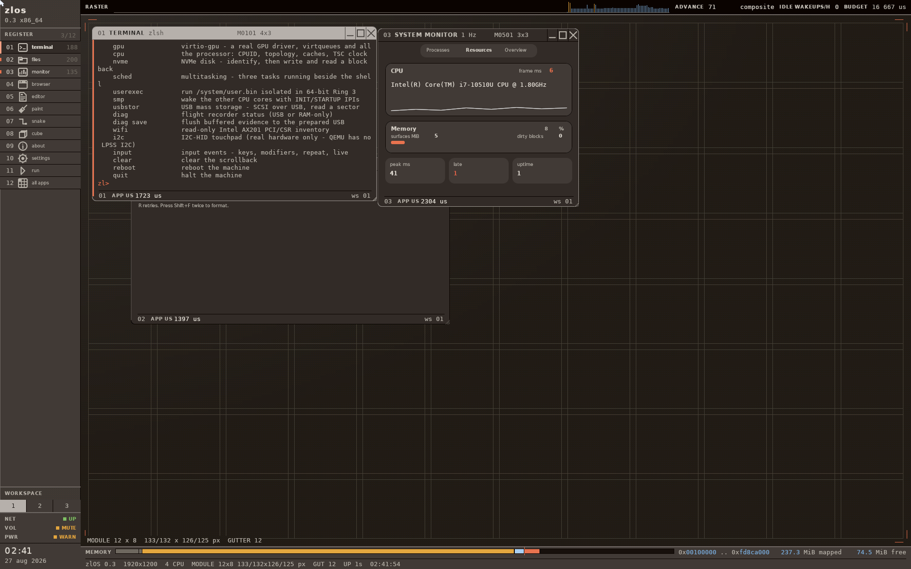

# zlOS

### One system. One language. No operating system underneath it.

[](https://github.com/RoyX4/ZlOS/actions/workflows/gates.yml)
[](https://github.com/RoyX4/ZlOS/actions/workflows/boot.yml)
[](https://github.com/RoyX4/ZlOS/actions/workflows/docs.yml)
[](https://github.com/RoyX4/ZlOS/actions/workflows/nightly.yml)



zlOS is an experimental x86 operating system written in **zl**, its own
self-hosting systems language. The repository contains the language toolchain,
boot paths, kernel, drivers, filesystem, network stack, compositor, desktop,
applications, tests, and the evidence used to separate what works from what is
only planned.

This is not a Linux distribution or a desktop theme. zlOS boots on bare metal
with its own UEFI application and kernel. Linux is used to build and test it.

## What works now

| Area | Current implementation | Evidence boundary |
|---|---|---|
| Boot | Native 64-bit UEFI, raw BIOS, and GRUB BIOS/UEFI routes | Current host/build/QEMU gates pass; current exact-image ThinkPad proof remains incomplete |
| Kernel | Paging, APIC/interrupts, physical memory, scheduler, syscalls, and protected 64-bit Ring 3 | Host and QEMU evidence; not a production security claim |
| Desktop | Presswork compositor, windows, workspaces, terminal, files, monitor, editor, settings, utilities, and games | Current visual receipts exist; not every app route is physically exercised |
| Storage | NVMe, block cache, `zlfs`, named files, editor save-through, and a raw flight-recorder partition | Persistence exists; broader recovery and current physical write proof remain open |
| Network | Virtio/e1000, ARP, DHCP, DNS, TCP, TLS 1.3, HTTP, and a bounded browser | QEMU paths work; the ThinkPad's I219 and AX201 are not driven |
| Language | Interpreter, C and LLVM backends, direct x86-64 ELF generation, formatter, tests, examples, and editor support | The interpreter is semantic authority; backend subsets are explicitly bounded |

The complete, evidence-bound state is in
[`docs/PROJECT-STATUS.md`](../docs/PROJECT-STATUS.md). The next engineering order
is in [`docs/EXECUTION-ROADMAP.md`](../docs/EXECUTION-ROADMAP.md).

## The 906-feature program

zlOS tracks the intended whole product as 906 individually identified features.
The current generated ledger reports:

| Maturity | Count | Meaning |
|---|---:|---|
| `PROVED_CURRENT` | **8** | Current evidence closes the feature's present acceptance contract |
| `PARTIAL_CURRENT` | **51** | Real implementation/evidence exists, but named gaps remain |
| `PLANNED_UNPROVED` | **847** | Planned in the complete program; not claimed as implemented |

The authority is
[`docs/program/FEATURE-STATUS.json`](../docs/program/FEATURE-STATUS.json), not a
marketing percentage. A passing inventory check proves the ledger is coherent;
it does not turn planned features into shipped ones.

## Try it

### Build the zl language tools

```bash
git clone https://github.com/RoyX4/ZlOS.git
cd ZlOS
./build.sh
./run_tests.sh
```

### Boot zlOS in QEMU

```bash
cd kernel
./build.sh
./run.sh
```

The native UEFI route has its own gate because ordinary BIOS/GRUB checks cannot
prove it:

```bash
cd kernel
./tools/checks/verify-efi.sh
```

See [`kernel/README.md`](../kernel/README.md) for dependencies and boot routes,
and the
[`ThinkPad first-boot guide`](../kernel/docs/guides/thinkpad-first-boot.md) before
writing an image to removable media.

## Downloads

There is currently **no public binary release**. The development image is
buildable and has exact local/QEMU evidence, but the repository's release gate
correctly blocks redistribution until project licensing and every packaged
input's provenance are settled. See
[`LICENSE-STATUS.md`](../LICENSE-STATUS.md).

That is a release boundary, not a claim that the source or boot image does not
work. The source remains available for inspection and local development.

## Repository map

| Path | Owns |
|---|---|
| [`kernel/`](../kernel/) | zlOS kernel, drivers, desktop, applications, images, and boot gates |
| [`src/`](../src/) | zl language frontend, runtimes, and code-generation backends |
| [`stdlib/`](../stdlib/) | zl standard-library modules |
| [`tests/`](../tests/) | Language conformance and regression programs |
| [`docs/program/`](../docs/program/) | Complete feature program, contracts, evidence joins, and delivery order |
| [`docs/evidence/`](../docs/evidence/) | Dated receipts and bounded observations |

For source ownership, use [`docs/CODE-MAP.md`](../docs/CODE-MAP.md). For the
repository's history/branch/worktree closure, use the
[`whole-topology receipt`](../docs/evidence/integration/WHOLE-TOPOLOGY-CLOSURE-2026-08-30.md).

## Contributing and security

Read [`CONTRIBUTING.md`](CONTRIBUTING.md) before changing code. Every claim must
name its evidence lane: source inspection, host tests, build, QEMU, physical
hardware, or release. They are not interchangeable.

For vulnerabilities, follow [`SECURITY.md`](SECURITY.md) and use GitHub's
private vulnerability-reporting path rather than opening a public issue.

## Project status

zlOS is active experimental systems software, not a production-ready operating
system. The project deliberately preserves software fallbacks and refuses to
promote QEMU results into physical-hardware claims. Current priorities are
measured responsiveness, durable storage/recovery, protected processes,
hardware networking, driver depth, and application completeness.
